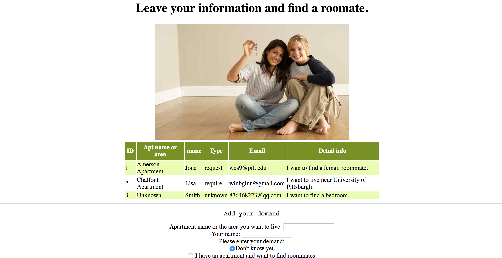

# HouseRater
1. What is the proposed name for your Web application?
   - HouseRater
2. Who is the target audience for your Web application?
   - People want to find nice roommates before they move in and people who want to read others' 
     comments on the house they are intended to live in.
3. What problem is it intended to solve for the target audience?
   - Some have trouble getting on with their roommates, because they don't know their roommates
     well before move in, Our website can provide these people a chance to choose their own roommmates.
     People who already in a house and want to find a roommate can use our website to find one. And 
     those who don't rent a house and want to find a roommate to live with can also use our website.
     Furthermore, people are not satisfied with their apartment after they live for some days, and our website
     can gather the tenants' comment on the apartment which will show people the real living condition of
     the apartment and help them choose their apartment.
4. How will it meet the minimum project requirements?
  - My site will include three major parts. The first part can help people find a good roommate to live with,
    and the second part provide a platform to tenants to review their apartment and provide some detail
    situations of the apartment. And other users can read these reviews after login. The third part is an area that people
    want to find a house to post their demand. Someone who read it can provide some information for him.
5. Why is your proposed Web application unique or creative beyond simply meeting the minimum requirements?
  - It's a platform that tenants, people who want to find rommmates, and those seek for an apartment will meet.
    And they can share some information of the house, and send their demand of the house of or the roommates.
    People can also communicate with each other by the contact information they provided.

## Build status
[](https://travis-ci.org/infsci2560sp17/full-stack-web-ninazhang935)

## Changelog
 
[Changelog](CHANGELOG.md) 

## Web Site

[HouseRater](https://dry-waters-29024.herokuapp.com/)

## Key Features


* User login and sign up
* put data
* get data
* delete data
* post data
* edit data
* upload file

## Project Details

### Main Page

The main page incudes the several main functions of the website.


### User Input Form

Users can add their own demand to find a roommate click button then the record
is dynamically added to the chart above.


## API

### API Method 1

    POST photos/:id/tags

#### Parameters

- **id** _(required)_ — The user ID to add plan.
- **tags** _(required)_ — Comma separated tags.

#### Response

A JSON or XMLobject containing the PhotoID and list of tags accepted.

#### Errors

All known errors cause the resource to return HTTP error code header together with a JSON array containing at least 'status' and 'error' keys describing the source of error.

- **404 Not Found** — The photo was not found.

#### Example

##### Request

    POST /v1/photos/123456/tags

##### Body

    tags=cute,puppy


##### JSON Response

```json
{
    "photoId": 123456,
    "tags": ["cute", "puppy"]
}
```

##### XML Response

```xml
<?xml version="1.0" encoding="UTF-8"?>
<PhotoTags>
    <photoId>123456</PhotoId>
        <tags>
            <tag>cute</tag>
            <tag>puppy</tag>
        </tags>
</PhotoTags>
```

## Technologies Used

TODO : List all technologies used in your project

- [Spring Boot](https://projects.spring.io/spring-boot/) - Takes an opinionated view of building production-ready Spring applications.
- [Thymleaf](http://www.thymeleaf.org/) - Thymeleaf is a modern server-side Java template engine for both web and standalone environments.
- [Maven](https://maven.apache.org/) - Apache Maven is a software project management and comprehension tool.
