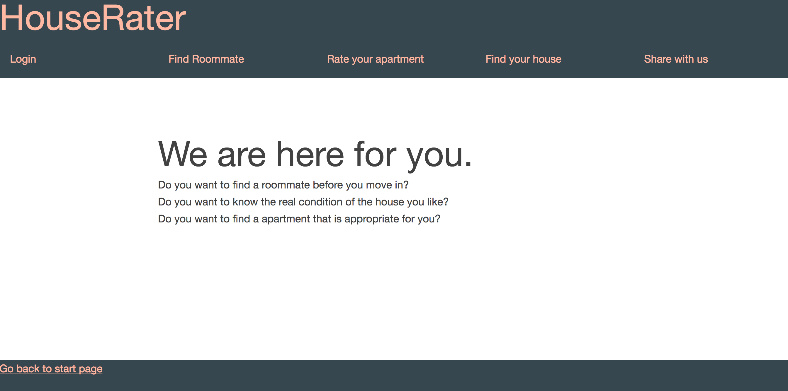

# Diet
1. What is the proposed name for your Web application?
   - Diet
2. Who is the target audience for your Web application?
   - People want to lose weight or keep a diet. 
3. What problem is it intended to solve for the target audience?
   - More than a half People who want to loose weight can not keep going, 
     they usually give up on the half way because of lacking encourage, motivation or supervision. 
     People want to keep in good shape probalby get into hard condition to choose something to eat,
     because some food may contains much more calorie than one can imagine which will ruin the whole 
     diet plan or the whole day's working-out. Some have monotonous dishes like vegetables and fruits 
     just in case of intake much calorie. I'll provide all kinds of healthy food and recommand abundant
     low-calorie dishes that people can choose from.
4. How will it meet the minimum project requirements?
  - My site will include three parts: make your plan, low-fat menu, share with others.
    People can access to the low-fat menu part without a login. But login is required if they want to 
    customize their own plan, share their meal or commend on others' posting. I will store the login 
    information and each user's plan to database. People can update their weight whenever they want. 
    The system can remind you to keep going if you don't update you information for a long time.
5. Why is your proposed Web application unique or creative beyond simply meeting the minimum requirements?
  - People can customized their own plan in order to lossing weight or not putting up weight. 
    And I can supervise them whether they keep going as well as they keep a healthy weight. 
    Besides, the web application can send each user some encourage emails everyday to inspire them.
    And people can share their meal, working-out records or the outcome of the plan. 
    They can connect with each other to share some useful experience and encoureage others.


## Build status
[](https://travis-ci.org/infsci2560sp17/full-stack-web-ninazhang935)

## Changelog
 
[Changelog](CHANGELOG.md) 

## Web Site

[Diet](https://dry-waters-29024.herokuapp.com/)


## Key Features


* User login
* make your plan 
* Key Feature N

## Project Details

### Landing Page

The homepage encourages users to use this website, and remind user to login.


### User Input Form

Users can make their own plan by entering their name and choosing a plan.
(https://.../image.jpg)

## API

TODO : please provide a description of at least 1 API including a sample of request data and response data in both XML and JSON format.

### API Method 1

    POST photos/:id/tags

#### Parameters

- **id** _(required)_ — The user ID to add plan.
- **tags** _(required)_ — Comma separated tags.

#### Response

A JSON or XMLobject containing the PhotoID and list of tags accepted.

#### Errors

All known errors cause the resource to return HTTP error code header together with a JSON array containing at least 'status' and 'error' keys describing the source of error.

- **404 Not Found** — The photo was not found.

#### Example

##### Request

    POST /v1/photos/123456/tags

##### Body

    tags=cute,puppy


##### JSON Response

```json
{
    "photoId": 123456,
    "tags": ["cute", "puppy"]
}
```

##### XML Response

```xml
<?xml version="1.0" encoding="UTF-8"?>
<PhotoTags>
    <photoId>123456</PhotoId>
        <tags>
            <tag>cute</tag>
            <tag>puppy</tag>
        </tags>
</PhotoTags>
```

## Technologies Used

TODO : List all technologies used in your project

- [Spring Boot](https://projects.spring.io/spring-boot/) - Takes an opinionated view of building production-ready Spring applications.
- [Thymleaf](http://www.thymeleaf.org/) - Thymeleaf is a modern server-side Java template engine for both web and standalone environments.
- [Maven](https://maven.apache.org/) - Apache Maven is a software project management and comprehension tool.
